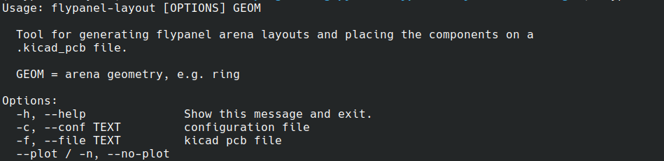
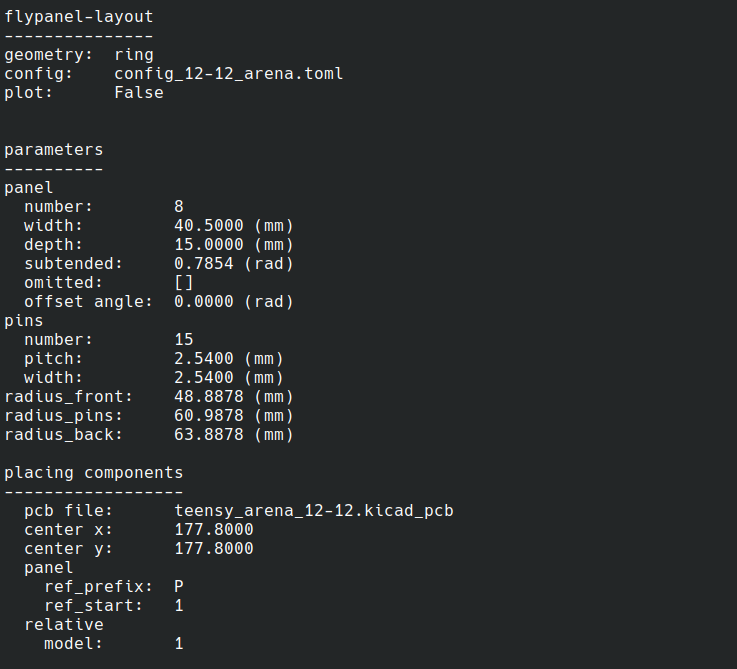
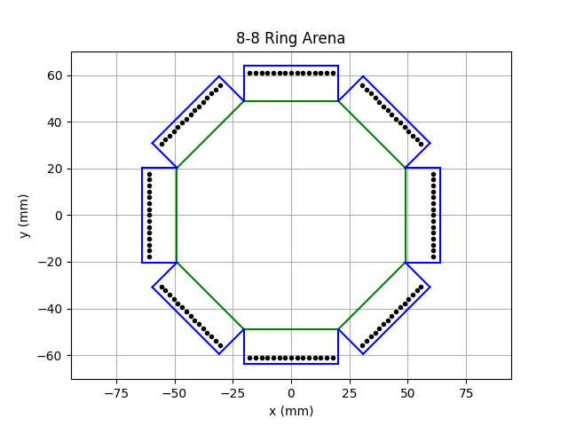
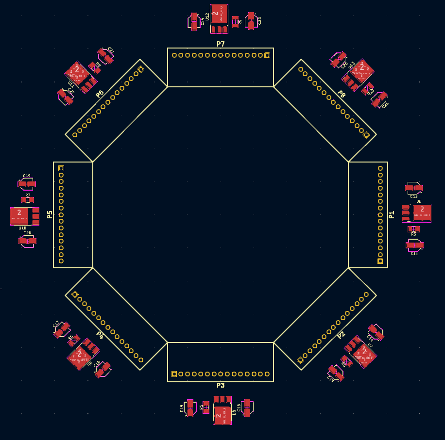

## flypanel-layout-tools

Python library and command line tools for design and layout of flypanel arenas.


### Installation

Can be installed with pip or [poetry](https://python-poetry.org/).

Using pip

```bash
pip install .
```

Using poetry
```bash
poetry install 
```

### Command line interface




### Example output


cli output 



arena plot


layout example

